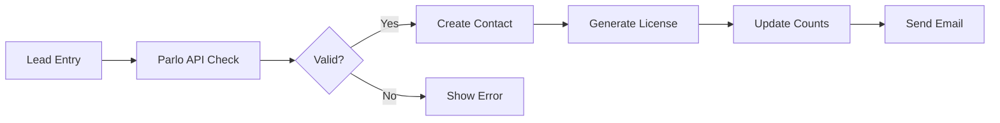

# Parlo License Manager

## Overview

Parlo License Manager is a Frappe app that provides comprehensive license management for organizations. It integrates seamlessly with Frappe's CRM module to manage license allocation, tracking, and validation through Parlo and Million Verifier APIs.

## Features

### 🎯 Core Features
- **Organization-based License Management**: Manage licenses directly within Organization doctype
- **Campaign Code Tracking**: Link leads to organizations via Branch.io campaign codes
- **License Series Management**: Auto-generate licenses with prefix and series (e.g., ORG-00001)
- **Role-based Access Control**: License Manager and Organization Member roles
- **API Integrations**: Parlo API and Million Verifier for validation

### 📊 Dashboard Features
- **Two-section View**: Allocated licenses and unallocated leads
- **Search Functionality**: Search by email or phone number
- **Bulk Operations**: Multi-select for bulk license allocation
- **Excel Upload**: Bulk license allocation via Excel files
- **Usage Statistics**: Visual progress bars and statistics

### 🔐 Security & Permissions
- **Role-based Access**: System Manager, License Manager, Organization Member
- **Organization Isolation**: Users only see their organization's data
- **API Key Management**: Secure storage in Parlo Settings

## Installation

### Prerequisites
- Frappe Framework v15+
- Python 3.10+
- Working Frappe bench setup

### Step 1: Get the App
```bash
cd frappe-bench
bench get-app https://github.com/sagar-j-gurav/parlo-license-manager.git
```

### Step 2: Install on Site
```bash
bench --site yoursite.local install-app parlo_license_manager
bench --site yoursite.local migrate
```

### Step 3: Clear Cache and Restart
```bash
bench --site yoursite.local clear-cache
bench restart
```

## Configuration

### 1. Setup API Keys
1. Go to **Parlo Settings** (search in awesome bar)
2. Enter:
   - Parlo API Key
   - Million Verifier API Key
   - Parlo Session Cookie (optional)

### 2. Setup Organization
1. Go to **Organization** list
2. Create or edit an organization
3. In "Parlo License Management" section:
   - Check "Has Parlo License"
   - Set Campaign Code from Branch.io
   - Set License Prefix (e.g., "ORG-")
   - Set Total Licenses purchased
   - Add License Manager users

### 3. Assign Roles
1. Go to **User** list
2. For license managers:
   - Add "License Manager" role
   - Add user email to Organization's license_managers field
3. For organization members:
   - Add "Organization Member" role
   - Create Contact linked to Organization

## Usage

### Authentication Flow
1. Users visit `/parlo-auth`
2. Enter mobile number or email
3. System validates via Parlo API
4. On success, redirects to dashboard

### License Dashboard
1. Access at `/parlo-dashboard`
2. View allocated and unallocated sections
3. Search contacts and leads
4. Allocate licenses individually or in bulk

### Bulk Upload
1. Prepare Excel with columns:
   - `phonenumber` (with country code)
   - `full_name`
   - `email`
   - `campaign_code` (optional)
2. Upload via dashboard
3. Review validation results
4. Confirm allocation

## Workflow

### License Allocation Flow


### Permission Hierarchy
- **System Manager**: Full access to all organizations
- **License Manager**: Manage assigned organizations
- **Organization Member**: View-only access

## API Endpoints

### Whitelisted Methods
- `allocate_license`: Allocate license to contact
- `deallocate_license`: Remove license from contact
- `check_license_availability`: Check available licenses
- `search_contacts_and_leads`: Search functionality
- `allocate_licenses_to_leads`: Bulk allocation
- `validate_bulk_upload`: Validate Excel file
- `process_bulk_allocation`: Process bulk allocation

## File Structure
```
parlo_license_manager/
├── api/
│   ├── parlo_integration.py
│   └── million_verifier.py
├── utils/
│   ├── license_generator.py
│   ├── bulk_upload.py
│   └── organization.py
├── www/
│   ├── parlo_auth.html/py
│   └── parlo_dashboard.html/py
├── patches/
│   └── migrate_from_organization_license.py
├── hooks.py
├── install.py
└── permissions.py
```

## Migration from v1.0

If upgrading from v1.0 (separate Organization License doctype), see [MIGRATION_GUIDE.md](MIGRATION_GUIDE.md)

## Troubleshooting

### Custom Fields Not Visible
```bash
bench --site yoursite execute parlo_license_manager.install.after_install
```

### Permissions Not Working
```bash
bench --site yoursite execute parlo_license_manager.install.create_custom_roles
```

### License Counts Mismatch
```python
# In bench console
import frappe
from parlo_license_manager.utils.organization import update_license_counts
update_license_counts("Your Organization Name")
```

## Development

### Running Tests
```bash
bench --site yoursite run-tests --app parlo_license_manager
```

### Contributing
1. Fork the repository
2. Create feature branch
3. Commit changes
4. Push to branch
5. Create Pull Request

## License

MIT License - see LICENSE file for details

## Support

For issues or questions:
- Check [COMPLETE_IMPLEMENTATION.md](COMPLETE_IMPLEMENTATION.md) for detailed features
- Review [MIGRATION_GUIDE.md](MIGRATION_GUIDE.md) for v2.0 changes
- Create an issue on GitHub

## Version
- **Current**: 2.0.0
- **Compatible with**: Frappe v15+
- **Python**: 3.10+

## Authors

- Parlo Team
- Contributors